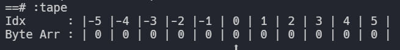
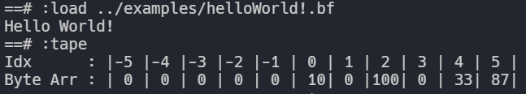
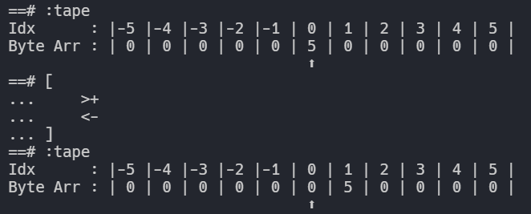

# BrainFu*k Interpreter In Haskell

This is a BrainFu\*k Interpreter. It also Comes with a simple Transpiler To transpile your BrainFu\*k code to C code which can then be compiled.
<br>
It Comes with a Python styled Repl to Make BrainFu\*k less BrainFu\*k <br>


## How To Build
Make sure that you have <a href="https://www.haskell.org/ghc/">GHC</a> installed <br>
Inside the src folder you may use the following commands to compile/run the interpreter
```
ghc brainfcuk.hs
```
or
```
runhaskell brainfcuk.hs
```

## How To Use The Interpreter
use -h flag to see help when running the interpreter<br>
``` runhaskell brainfcuk.hs -h``` <br>
or<br>
```./brainfcuk -h``` 
```
Usage :
    brainfcuk
         |start the brainfcuk repl

    brainfcuk <name>
    brainfcuk -f <name>
         | interpret the file provided as an argument

    brainfcuk -i <name>
         | interpret file and start the repl in the same context of as the file

    brainfcuk -c <name>
         | compile the file to c code which can then be compiled using gcc
```

## How To Use The Repl
use :help in the repl to view the repl help
```
Repl Commands :
    :help          => display this help
    :quit          => quit the repl
    :tape          => print the byte array
    :reset         => reset the byte array to 0
    :load   <name> => interpret file provided as an argument
```
## Repl Examples
<br>
The Byte Array
<br>

<br><br>
Loading a BrainFu\*k File and Interpreting it
<br>

<br><br>
MultiLine Loops
<br>

